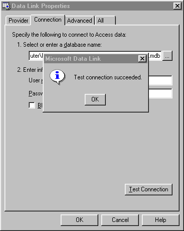

<div align="center">

## UDL files


</div>

### Description

Use UDL files for your dataconnections instead of DSN.
 
### More Info
 


<span>             |<span>
---                |---
**Submitted On**   |
**By**             |[Jos Keuter](https://github.com/Planet-Source-Code/PSCIndex/blob/master/ByAuthor/jos-keuter.md)
**Level**          |Beginner
**User Rating**    |4.9 (34 globes from 7 users)
**Compatibility**  |VB 5\.0, VB 6\.0, VB Script, ASP \(Active Server Pages\) , VBA MS Access, VBA MS Excel
**Category**       |[Databases/ Data Access/ DAO/ ADO](https://github.com/Planet-Source-Code/PSCIndex/blob/master/ByCategory/databases-data-access-dao-ado__1-6.md)
**World**          |[Visual Basic](https://github.com/Planet-Source-Code/PSCIndex/blob/master/ByWorld/visual-basic.md)
**Archive File**   |[](https://github.com/Planet-Source-Code/jos-keuter-udl-files__1-27692/archive/master.zip)


### Source Code

```
Searching planet-source-code for 'UDL' resulted into nothing to my surprise. That's why I want to explain the basic use of it for your information and also hoping soon there will be some more articles or code-examples this subject.
1. Creating an UDL file.
Create a new textfile on your desktop and rename it as 'MyFirstUDL.udl'. Having done that you'll see that the icon has changed. Double-click it and voila! You can setup a dataconnection to any database and it works just like creating a DSN-connection.
2. Using an UDL file.
No you can reference this file from your code like this:
Set cnn = New ADODB.Connection
cnn.open "File Name=C:\...\Desktop\MyFirstUDL.udl"
3. What's the use?
You can add this file to your setup-project. So if your program has to change dynamically to another database you just have to call the UDL file, make the proper adjustments via the UDL-interface and reconnect to the database via the UDL.
I hope you find this as usefull as I did. I was searching for a peace of code wich builds UDL-files from the ground up. I anybody knows where to find code like this pleace mail me! Or else I have to build it myself... and I'm a lazy programmer! ;-)
```

